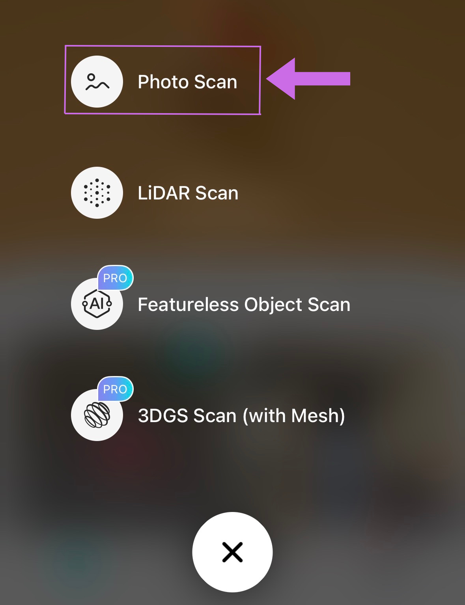
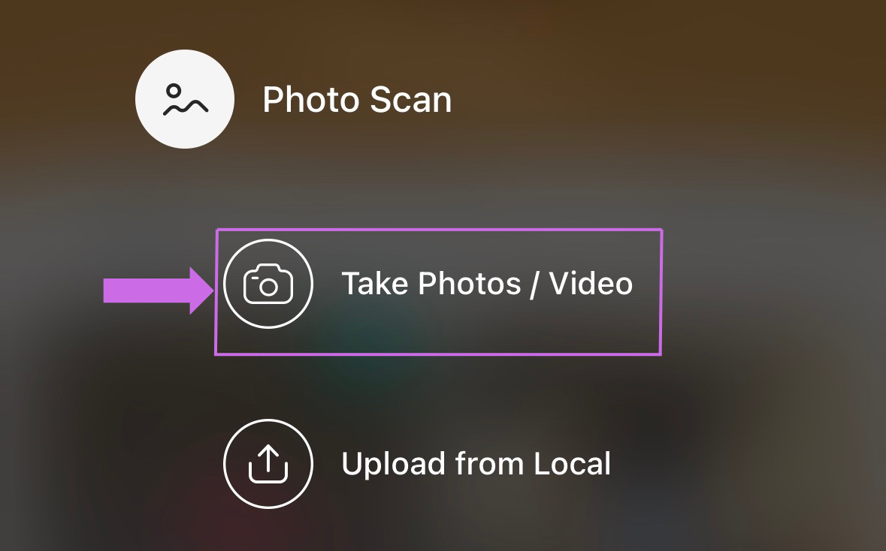
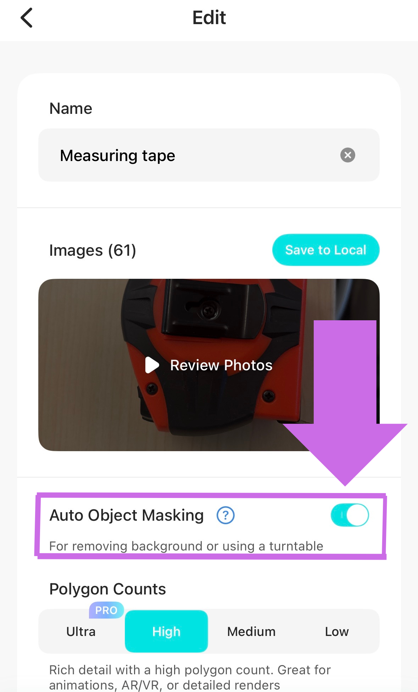
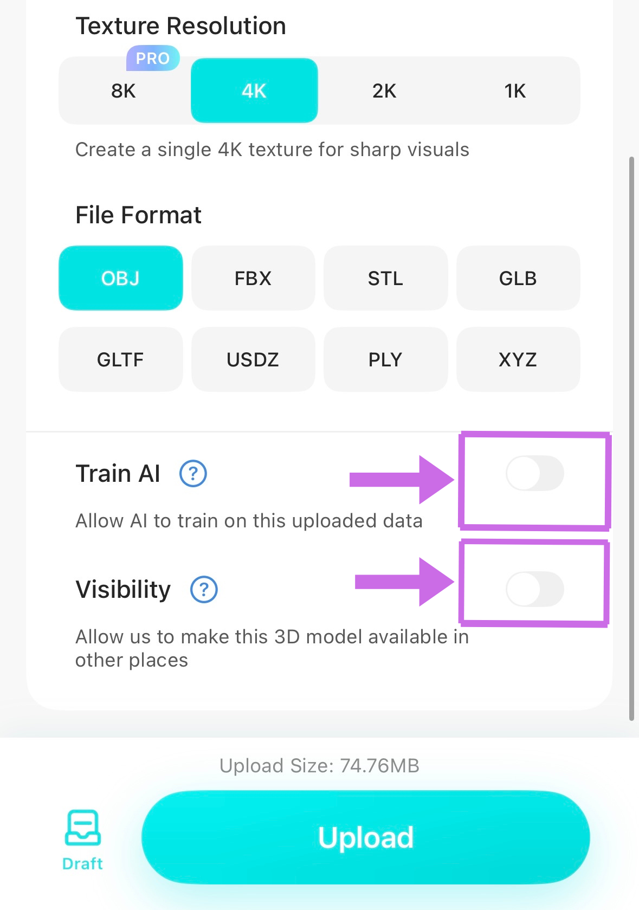

# 3D Scanning an Object

1. To begin a new scanning project, click on the **+** button at the bottom of the screen. Then, choose *“Photo Scan”*, unless you have a phone equipped with LiDAR (like an iPhone Pro). Then select *“Take Photos / Video”* to proceed.
 

2. Take the photos manually as you circle around your object 3 times at 3 different angles. You can also put the object on a piece of paper and rotate the object with each photo you take to get full coverage.

3. Move slowly and take 25 or more photos for each of the 3 circlings of the object, each circling at a different angle. The more detailed your object is, the more photos you may require to complete a scan. Experiment. The bottom left of the screen shows your photo count and the ideal number of photos to take. The free version of the app allows for 150 images per scan. Try to get the top and bottom as well by taking photos from above or by turning the object over. *Note that the object will retain the lighting from the room you are in*.

4. Once you’re done, you can name the scan and choose settings for processing. At this point, you can also look through all your photos and delete any that might cause issues. These could include blurry images or uncentered images. 

5. On the settings screen, be sure to go through all of them and change accordingly. Turn on **“Auto Object Masking”** so the app removes background objects like the table surface.

6. For *"Polygon Counts"*, you can select how many polygons you want and the texture resolution. The higher you pick, the higher the resolution of the model. For *"Texture Resolution"*, picking 4K will provide higher resolution and sharper visuals. Higher settings will make your model more detailed and thus make your file larger.

7. For File Format, choose *.STL* (good for 3D printing) or *.OBJ* (will preserve colours for digital display as in example above). 

8. There are options to Train AI with your model. If you are not interested, turn that off. There is also an option to make your model visible and available for others to use. Be sure to turn this off if you do not want other people to be able to view or use your model.

9. Press *“Upload”* to begin creating the model. It can take 10 minutes to 1 hour to process your model before you can see how it turned out. Once finished processing, you can view your model in the app and press *“Export”* to send it to your email (or send to drafts if unfinished).
  
10. To request a 3D print of your model, go to lib.uvic.ca/order and fill out the form. It seems that Kiri exports the files in inches, but the software used in the UVic Libraries DSC to 3D print only works in millimetres, so the software will load the numbers incorrectly. In the web app notes, be sure to let the staff know what size you want your final print to be. 

Great job, now you have a 3D scan!

[NEXT STEP: 3D Scanning Activity](informal-credentials.md){: .btn .btn-blue }
